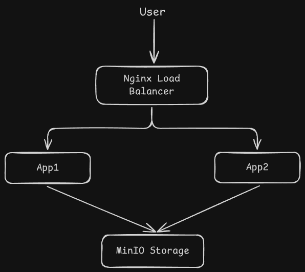
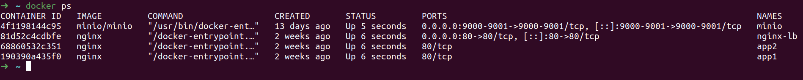
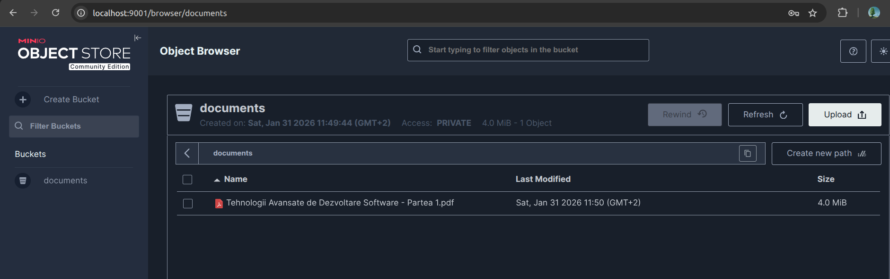

# SecureDocs - Proof of Concept (Aplicație de Stocare Documente) 🚀

## 📝 Descriere Proiect
SecureDocs este un Proof of Concept (PoC) dezvoltat pentru a demonstra implementarea unei arhitecturi web moderne, distribuite și securizate. Proiectul separă clar responsabilitățile componentelor (Infrastructură ca Cod / DevOps) pentru a asigura scalabilitate și un nivel ridicat de securitate.

---

## 🗺️ 1. Diagrama de Arhitectură & Fluxul de Date
Sistemul este împărțit în două zone logice distincte pentru a reduce suprafața de atac:
* **Zona Publică:** Conține doar utilizatorul și Load Balancer-ul (Nginx).
* **Zona Privată:** Include serverele de aplicație și serviciul de stocare (izolate complet de exterior).

**Fluxul datelor:** `User` ➡️ `Load Balancer (Nginx)` ➡️ `Application Servers (App1 / App2)` ➡️ `Storage (MinIO)`.

---

## 🛠️ 2. Stack-ul Tehnologic & Argumentare
* **Docker & Docker Compose:** Folosit pentru containerizare unitară, izolare și replicare rapidă.
* **Docker Networks:** Utilizat pentru crearea rețelelor izolate (`public-net` și `private-net`).
* **Nginx:** Configurează rolul de Reverse Proxy și Load Balancer eficient pentru gestionarea conexiunilor simultane.
* **MinIO Object Storage:** Soluție de stocare persistentă a documentelor, compatibilă cu Amazon S3.
* **OS Gazdă:** Ubuntu 22.04 LTS.

---

## 💾 3. Persistența Datelor & Mentenanță
* **Volume Docker:** Asigură persistența fișierelor din bucket-ul `documents` în MinIO, chiar dacă containerele sunt repornite sau șterse.
* **Scalabilitate Orizontală:** În caz de trafic intens, stratul de aplicație poate fi multiplicat instant prin pornirea de noi instanțe, preluate automat de Nginx.
* **Zero Downtime Deployments:** Suport conceptual pentru strategii de tip *rolling update* pentru actualizări fără întreruperi de serviciu.

---

## 📊 4. Demonstrație Practică (Starea Containerelor)
Toate componentele rulează izolat și stabil în ecosistemul Docker:

